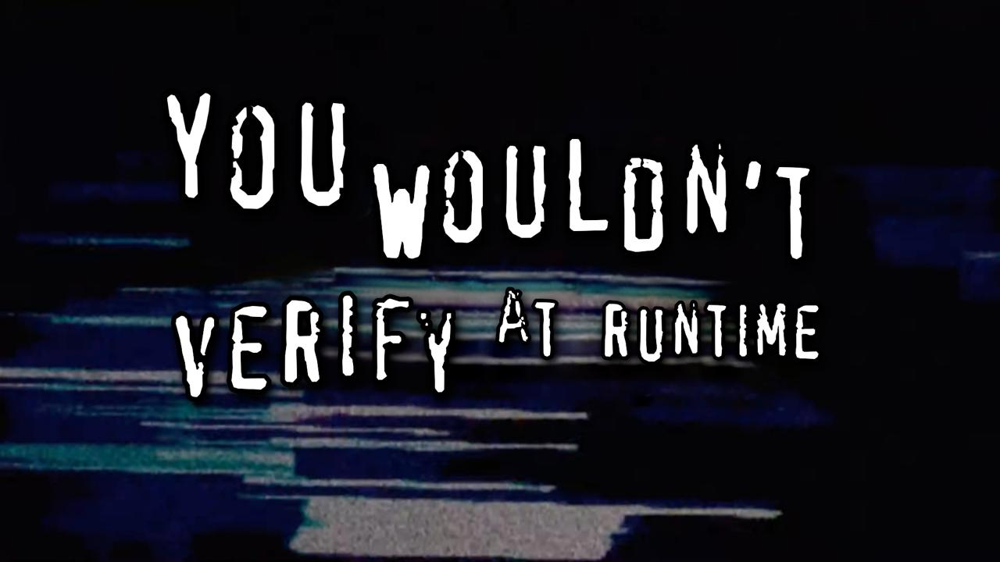
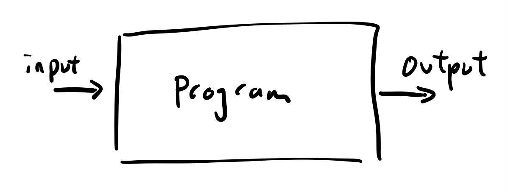
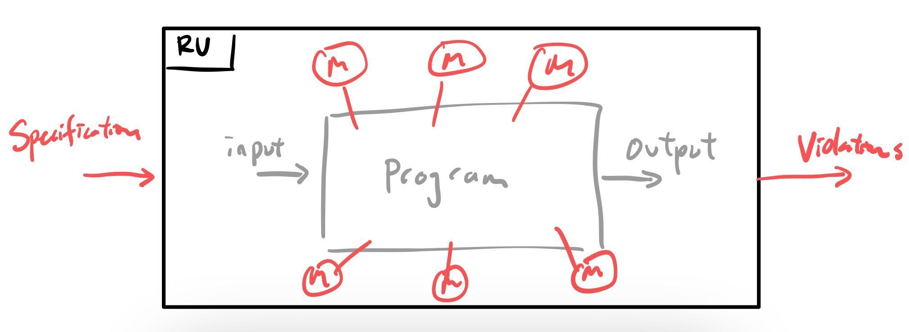
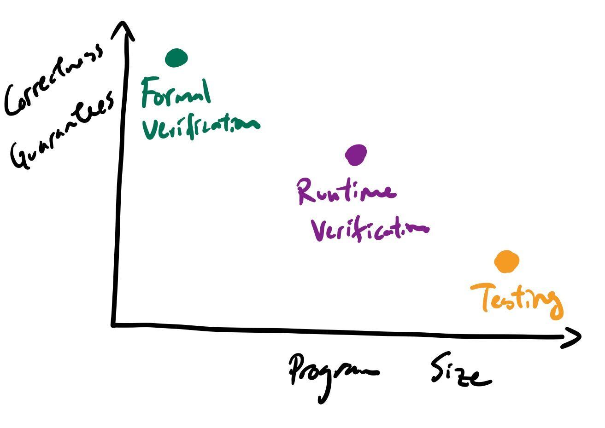

+++
title = "What is Runtime Verification?"
date = 2025-01-19
description = "A little primer on one of my old research topics"
[extra]
featured = true
short_title = "RV"
+++

You wouldn't verify a runtime. lol

**Disclaimers**: Runtime Verification, also referred to as Runtime Monitoring, is a broad term that means different things to different people. Additionally, there are various Runtime Verification systems and paradigms. In this blog post I will be referring to Runtime Verification a la the JavaMOP framework ([paper](https://fsl.cs.illinois.edu/publications/jin-meredith-lee-rosu-2012-icse.pdf), [Github](https://github.com/runtimeverification/javamop)) and its usage with Java unit tests, where my expertise in the area primarily comes from.

## What is Runtime Verification (RV)?

<!--
- Intro: Defining Runtime Verification (also called Runtime Monitoring)
  - While the program is running, check whether specifications are met.
  - Reason why it's called "verification" is bc theoretically you can recover after failure. So your programs will "always be correct".
    - Realistically (or often in JavaMOP), you raise an alarm when specs are violated so that the programmer can fix bugs later.
  - Draw funky RV + DUT box picture
-->

Runtime Verification (RV) is a _dynamic_ program analysis that checks program executions against _formally specified properties_. In other words, RV involves running a program, and checking information about that execution against specifications on things you want to have always true (or false) about your program. If a specification is _violated_, then it means that your property was not held by your program, implying the discovery of a bug.

To draw this out in a diagram...

In a normal program execution, our program takes in an input and produces an output. But, we don't necessarily know what is happening in the program itself. We can use debuggers, `printf` debugging, or logging to obtain information about program state, but we don't necessarily have a quick way to discern whether the *process* (i.e. the series of steps) is correct. Because of this, in normal program execution, we consider the program itself as a black box.

However, RV offers a way to *probe* the black box, and "see" the internals of the program process. RV can be considered a wrapper 

Some technicalities:
- RV is called Runtime _Verification_ because of the principle that a RV system can help the subject execution _recover_ from violations that it discovers. When an execution recovers from a buggy state, it would be "correct", hence the system "verifies" the correctness of the execution. In practice, when a violation occurs, an alarm is raised to indicate to the user the location of a likely bug. But, all of this is up to the user and the specifications they pass to the RV system.
- In JavaMOP, the analysis will be done _while_ the program is running (called online monitoring), but there are also variants of RV that output execution information to logs and do the checking separately (called offline monitoring).

### Why Runtime Verification?

<!--
  - Why is RV cool?
    - Formal verification vs testing
      - Formal verification: correctness guarantees via proving, but difficult to adopt in practice
      - Testing: no guarantees since we can only check outputs, but easy to adopt in practice
      - RV: the specific program execution we check is correct
-->

*I think I need to write some stuff about what it means to establish correctness. Formal guarantee means across ALL executions of the program, the program does what it is supposed to do*

Runtime Verification sits in a sweet spot where it can offer _some_ formal guarantees, while also having the flexibility to apply to more number of, and bigger programs. Two other prevalent ways to assess correctness of a program are **Formal Verification** and **Testing**. On one hand, formally verifying your code involves constructing a mathematical proof of the correctness of your program. This is the closest to being absolutely sure that your program is correct, but it also involves an expensive process and building background in theorem proving tools. On the other hand, we can test our program by feeding inputs and comparing outputs with expected ones. Testing is relatively less difficult than formally verifying, since we only have to consider the inputs and outputs. We also have testing frameworks and automatic test generators that can help us run and write tests for many programs. But testing never _proves_ correctness (without giving infinite inputs and outputs, which we cannot do), and we only see the end points of our program. Due to its ease, testing is the de-facto standard way of quality assurance/correctness checking, but what if we still wanted more _formal_ guarantees about our code?

In Runtime Verification, you provide a set of specifications. The specifications reason about the internals of your program, not just the input and output. Since it's a dynamic analysis, it will only apply to one execution at a time and hence not give you the full guarantees that formal verification does. But, you get more guarantees about the correctness of your program than simply testing does.<!-- Since RV simply needs executions, why not use the inputs used by your unit tests?-->

## An example

- An example where we find a bug
  - `iterator_has_next`
  - draw and explain monitor FSM
  - might be worth writing out the trace (alluding to trace slicing without actually defining it)

### A specification

## Runtime Verification in Practice

### Usefulness of RV
- Usefulness of RV (ASE '16)
  - Adding RV to the testing process!

### Open challenges and techniques

<!--
- Open challenges and techniques (ASE '16)
  - Scaling
    - eMOP
    - Kevin's work
  - Specification writing + quality
    - Will hopefully have a followup blog post about DSI!
-->

For more information, check out [_How Good Are the Specs? A Study of the Bug-Finding Effectiveness of Existing Java API Specifications_](https://www.cs.cornell.edu/~legunsen/pubs/LegunsenETAL16SpecEval.pdf) (Legunsen et al., ASE 2016).

## More Resources
- More resources
  - Cornell SE
  - [CS6156](https://www.cs.cornell.edu/courses/cs6156/2020fa/)
  - RV textbook?
  - Wikipedia is surprisingly verbose
  - RV conference
    - Other cool work: RV theory (hyperproperties), Cyberphysical systems
